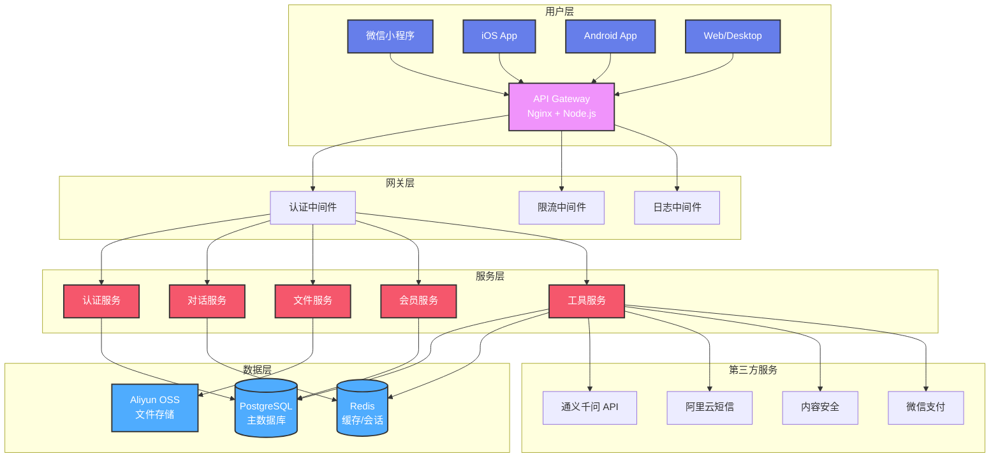
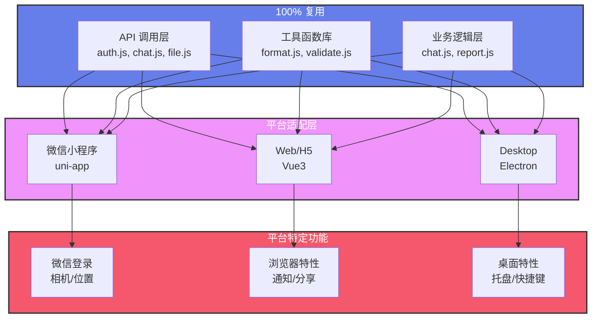
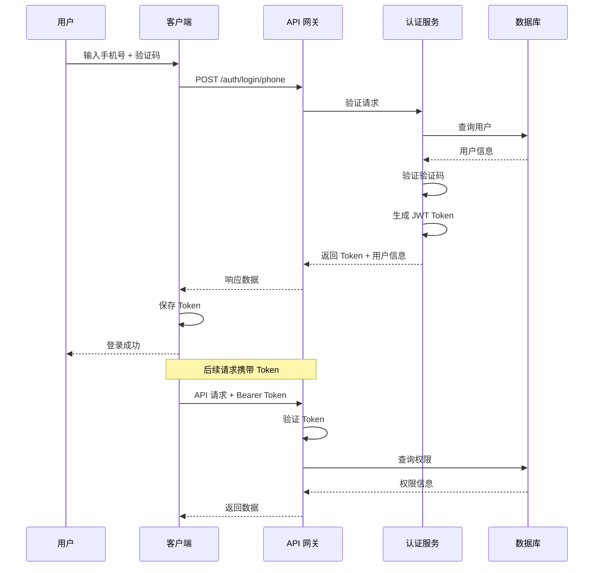
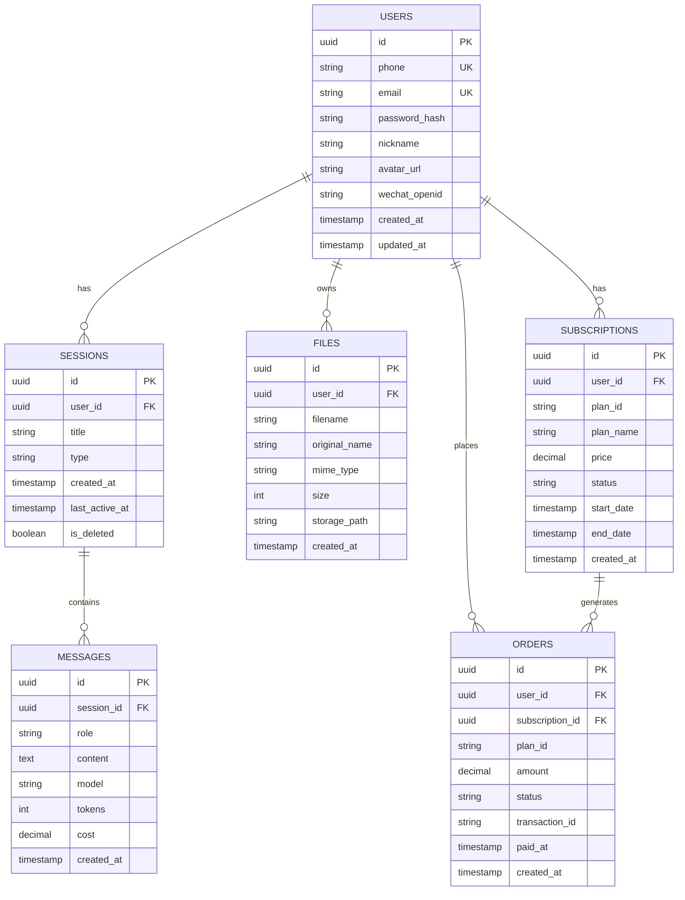
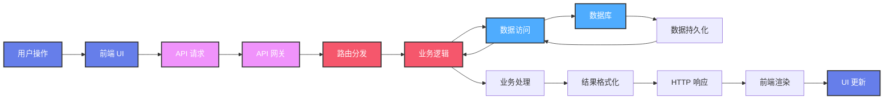
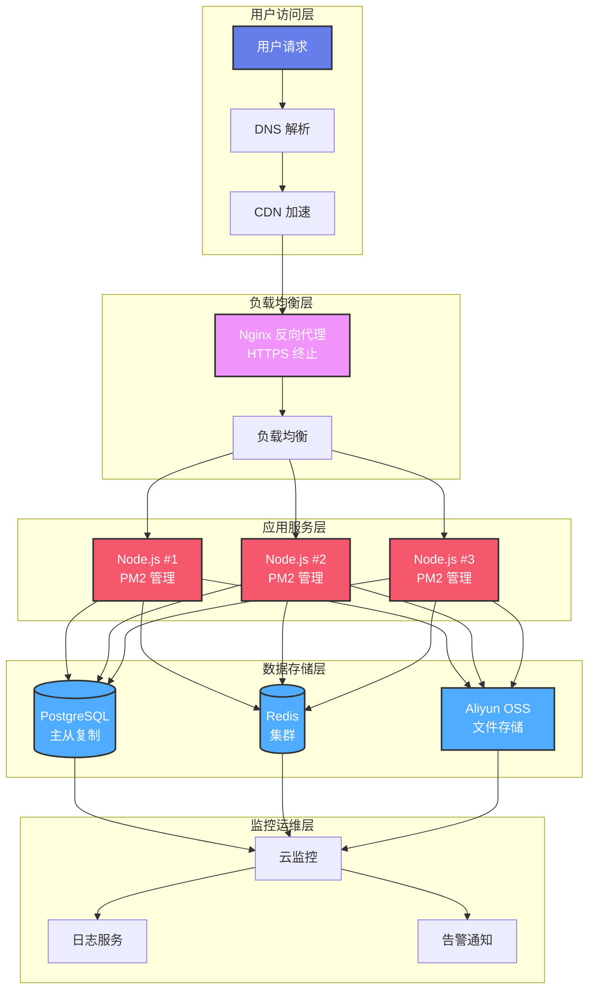
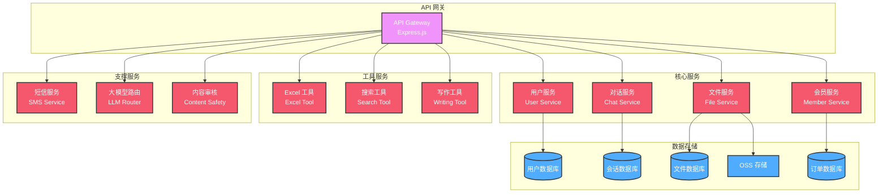
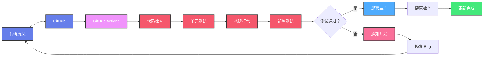
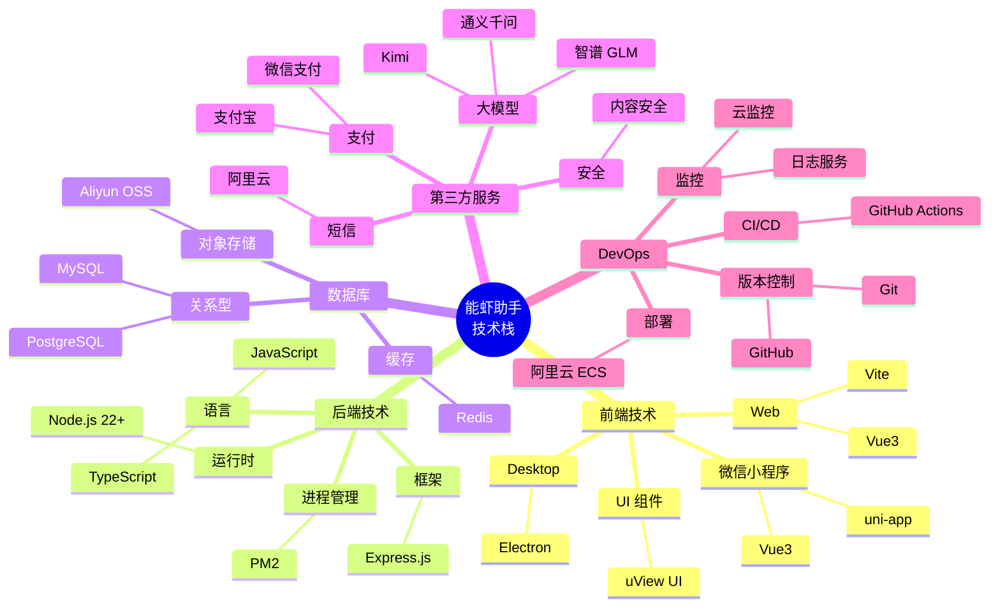
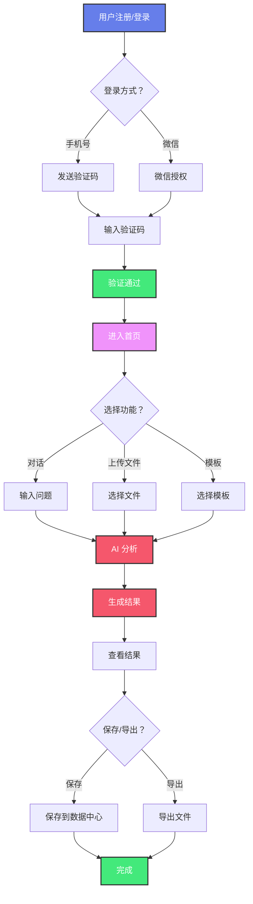

# 🦞 能虾助手 - 可视化架构图

**版本**: v1.0  
**更新日期**: 2026-03-12  
**工具**: Mermaid.js

---

## 1️⃣ 系统架构总览



---

## 2️⃣ 多端复用架构



---

## 3️⃣ 认证授权流程



---

## 4️⃣ 数据库 ER 图



---

## 5️⃣ 数据流架构



---

## 6️⃣ 部署架构



---

## 7️⃣ 微服务架构



---

## 8️⃣ CI/CD 流程



---

## 9️⃣ 技术栈全景图



---

## 🔟 业务流程图



---

## 📋 如何使用

### 在 GitHub 查看

1. 打开 `.md` 文件
2. GitHub 自动渲染 Mermaid 图表
3. 支持缩放和全屏查看

### 在本地查看

**方式 1: VS Code**
```
安装插件：Mermaid Preview
打开 .md 文件
预览图表
```

**方式 2: 在线编辑器**
```
访问：https://mermaid.live
复制图表代码
粘贴预览
```

**方式 3: Node.js**
```bash
npm install -g @mermaid-js/mermaid-cli
mmdc -i input.mmd -o output.png
```

---

🦞 **能虾助手出品 | 可视化架构图完成！**

*最后更新：2026-03-12*
