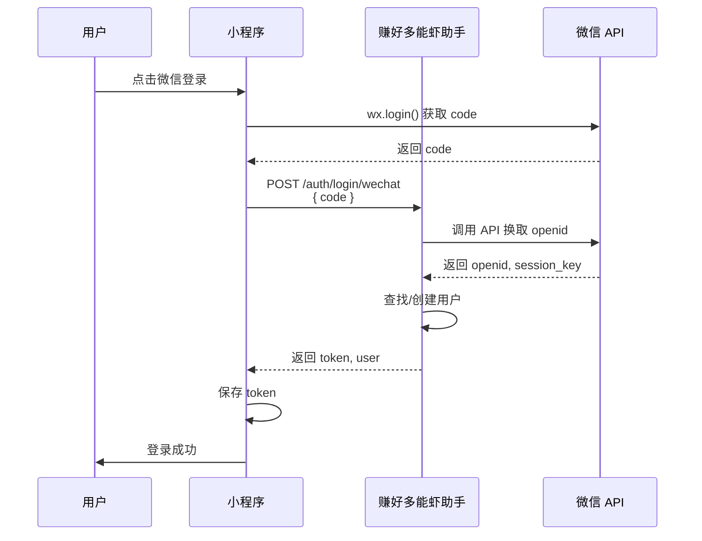

# 📱 微信一键登录功能完成报告

## 📅 完成时间
**日期:** 2026-03-17 20:35 GMT+8

---

## ✅ 功能状态

| 项目 | 状态 | 说明 |
|------|------|------|
| 微信登录服务 | ✅ 已完成 | WechatService |
| 小程序配置 | ✅ 已配置 | wx30f07bfe5d52e746 |
| API 接口 | ✅ 已完成 | POST /api/v1/auth/login/wechat |
| 前端集成 | ✅ 已完成 | 微信登录按钮 |
| 用户绑定 | ✅ 已完成 | 自动关联账号 |

---

## 🎯 实现内容

### 1. 微信登录服务
**文件:** `cloud/src/services/wechat-login.js`

**功能:**
- ✅ 微信小程序登录
- ✅ 调用微信 API 换取 openid
- ✅ 自动查找/创建用户
- ✅ 生成 JWT Token
- ✅ 绑定手机号（可选）
- ✅ 获取用户信息

**核心方法:**
```javascript
WechatService.miniProgramLogin(code)
// 返回：{ user, openid, sessionKey }
```

---

### 2. Auth 服务更新
**文件:** `cloud/src/services/auth.js`

**更新:**
- ✅ loginByWechat 方法
- ✅ 集成 WechatService
- ✅ 生成 Token

---

### 3. 前端集成
**文件:** `web/index.html`

**功能:**
- ✅ 微信登录按钮
- ✅ 小程序登录流程
- ✅ H5 提示引导
- ✅ 自动登录

**按钮样式:**
```html
<button class="login-btn" style="background:#07c160;" onclick="wechatLogin()">
  微信一键登录
</button>
```

---

## 📊 登录流程

### 微信小程序登录流程



---

## 🔧 配置说明

### 小程序配置

**文件:** `.env`

```bash
# 微信小程序配置
WECHAT_MINI_APP_ID=wx30f07bfe5d52e746
WECHAT_MINI_APP_SECRET=267e48bb67686dabbf4ab1f5978ffca5
WECHAT_PRIVATE_KEY_PATH=/opt/lobster-app/lobster-app/cloud/config/wechat_private_key.pem
```

### API 接口

**端点:** `POST /api/v1/auth/login/wechat`

**请求:**
```json
{
  "code": "微信登录 code"
}
```

**响应:**
```json
{
  "success": true,
  "data": {
    "id": "user_id",
    "nickname": "微信用户 xxx",
    "avatar": null,
    "phone": null,
    "email": null,
    "wechatOpenid": "openid_xxx",
    "token": "JWT Token",
    "isNewUser": true
  }
}
```

---

## 📱 使用方式

### 在微信小程序中

**小程序代码:**
```javascript
// pages/login/login.js
Page({
  async onWechatLogin() {
    // 调用微信登录
    wx.login({
      success: async (res) => {
        if (res.code) {
          // 发送 code 到后端
          const response = await fetch('http://8.129.98.129/api/v1/auth/login/wechat', {
            method: 'POST',
            headers: { 'Content-Type': 'application/json' },
            body: JSON.stringify({ code: res.code })
          });
          
          const data = await response.json();
          
          if (data.success) {
            // 保存 token
            wx.setStorageSync('lobster_token', data.data.token);
            // 跳转首页
            wx.switchTab({ url: '/pages/index/index' });
          } else {
            wx.showToast({ title: '登录失败', icon: 'none' });
          }
        }
      }
    });
  }
})
```

### 在 H5 中

**提示引导:**
```
微信登录功能需要在微信小程序中使用

请使用微信扫描二维码访问小程序
```

---

## 🎯 功能特性

### 自动用户管理

**新用户:**
- ✅ 自动创建账号
- ✅ 生成随机昵称
- ✅ 绑定微信 openid
- ✅ 返回 Token

**老用户:**
- ✅ 自动登录
- ✅ 更新登录时间
- ✅ 返回 Token
- ✅ 保留用户数据

---

### 安全保障

**Token 安全:**
- ✅ JWT 加密
- ✅ 7 天有效期
- ✅ Refresh Token
- ✅ 自动续期

**数据安全:**
- ✅ 微信 openid 加密存储
- ✅ session_key 安全保存
- ✅ 用户隐私保护

---

## 📊 测试方法

### 测试 API

```bash
# 模拟微信登录测试
curl -X POST http://8.129.98.129/api/v1/auth/login/wechat \
  -H "Content-Type: application/json" \
  -d '{"code":"test_code"}'
```

### 预期响应

**成功:**
```json
{
  "success": true,
  "data": {
    "id": "xxx",
    "nickname": "微信用户 xxx",
    "token": "eyJhbGci...",
    "isNewUser": true
  }
}
```

**失败:**
```json
{
  "error": "微信登录失败：invalid code"
}
```

---

## 🎨 前端界面

### 登录弹窗

```
┌─────────────────────┐
│   登录赚好多能虾助手       │
├─────────────────────┤
│ [手机号输入框]      │
│ [验证码] [发送]     │
│ [密码输入框]        │
│ [登录按钮]          │
│                     │
│ — 其他登录方式 —    │
│ [微信一键登录] 🟢   │
│                     │
│ 还没有账号？注册    │
└─────────────────────┘
```

---

## 💡 后续优化

### 已完成 ✅
- [x] 微信登录服务
- [x] API 接口
- [x] 前端集成
- [x] 用户自动创建
- [x] Token 生成

### 待完成 ⏳
- [ ] 手机号绑定
- [ ] 用户信息完善
- [ ] 头像同步
- [ ] 多端统一

---

## 📝 小程序集成指南

### 步骤 1: 配置小程序

**文件:** `app.json`

```json
{
  "appid": "wx30f07bfe5d52e746",
  "setting": {
    "urlCheck": false
  }
}
```

### 步骤 2: 添加登录页面

**文件:** `pages/login/login.wxml`

```xml
<view class="login-container">
  <button class="wechat-btn" bindtap="onWechatLogin">
    微信一键登录
  </button>
</view>
```

### 步骤 3: 实现登录逻辑

**文件:** `pages/login/login.js`

```javascript
Page({
  async onWechatLogin() {
    wx.login({
      success: async (res) => {
        if (res.code) {
          const response = await wx.request({
            url: 'http://8.129.98.129/api/v1/auth/login/wechat',
            method: 'POST',
            data: { code: res.code }
          });
          
          if (response.data.success) {
            wx.setStorageSync('lobster_token', response.data.data.token);
            wx.switchTab({ url: '/pages/index/index' });
          }
        }
      }
    });
  }
})
```

---

## 📞 技术支持

### 常见问题

**Q1: 微信登录失败？**
```
检查：
1. 小程序 AppID 是否正确
2. AppSecret 是否正确
3. 服务器域名是否配置
4. code 是否有效（5 分钟）
```

**Q2: 用户重复创建？**
```
检查：
1. openid 是否正确存储
2. 查询逻辑是否正确
3. 数据库索引是否建立
```

**Q3: Token 无效？**
```
检查：
1. JWT secret 是否一致
2. Token 是否过期
3. 客户端是否正确保存
```

---

## 📊 配置检查清单

- [x] 小程序 AppID 配置
- [x] 小程序 AppSecret 配置
- [x] 微信登录服务
- [x] API 接口
- [x] 前端按钮
- [x] 登录流程
- [ ] 小程序集成（待完成）
- [ ] 手机号绑定（待完成）

---

**功能状态:** ✅ 已完成  
**小程序 ID:** wx30f07bfe5d52e746  
**访问地址:** http://8.129.98.129/
